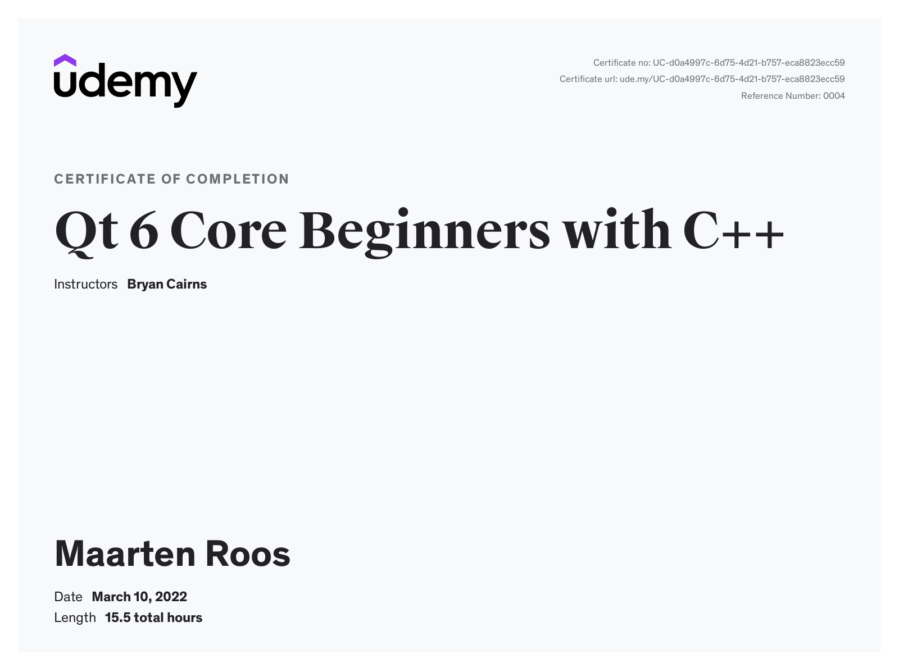
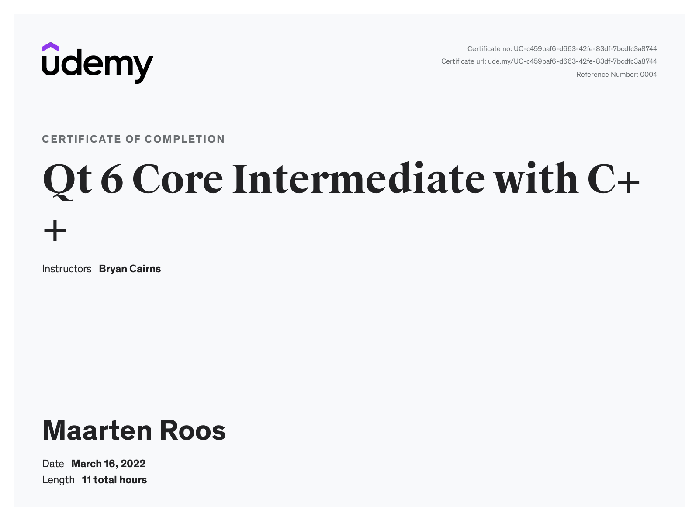
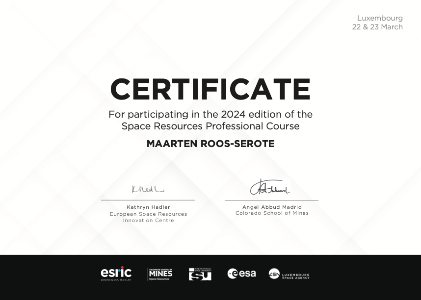
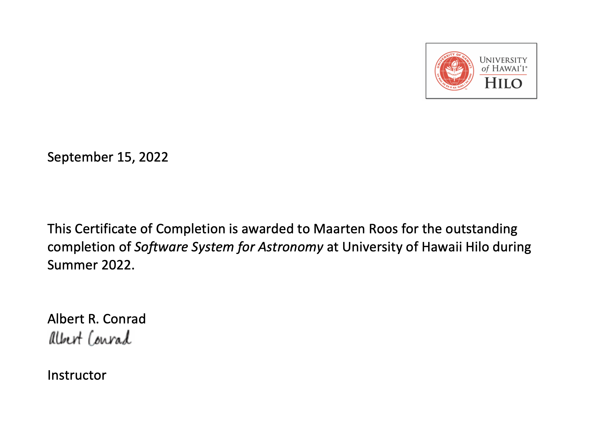

Relevant competences
=====================

Coding / Software
-----------------

I have been writing code ever since I got involved with research in 1991.
My code skills much increased while developing a complete software landscape (including GUIs) for data acquisition, reduction and analysis
for cardiac rhythm studies at the Erasmus University Hospital in Rotterdam, the Netherlands, between 2018 and 2024.
Unfortunately I cannot share any of these applications on GitHub, as practices of Open Science are uncommon in medical research.

* Python, Cython;
* C++;
* IDL;
* Fortran;
* Qt, PyQt;

* Plotly Dash;
* Git / GitHub;
* ImageJ.

Courses
-------

* `Transform to Open Science 101 <https://openscience101.org>`_ (`badge 23 May 2024 <https://www.credly.com/badges/fc06a593-a5e4-4f05-aa6d-27302e8bb22b/public_url>`_);
* Space Resources Professional Course, Luxembourg, 22-23 March 2024;
* Software Systems for Astronomy, Online, 5 July - 12 August 2022;

Techniques
----------

* Radiative transfer modeling of planetary atmospheres;
* Reduction and analysis of visible photometry of Solar System minor bodies;
* Acquisition, reduction and analysis of radio astronomical observations of Mars, using the Westerbork Synthesis Radio Telescope (the Netherlands) and the Nançay Radio Telescope (France)(:ref:`Nançay Continuum Data Reduction Tool <ncdrt>`).

Observing
---------

*on-site*

* Photometry of Centaurs at the 1.5 meter National Telescope at the Calar Alto Observatory,  Spain (2-7 Feb. 2000, 19-27 Jan. 2001)(:ref:`publications 17 - 19 <publication19>`);
* Photometry of Centaurs and TNOs at the 1.5 meter telescope at Sierra Nevada Observatory, Spain (23-29 Oct. 2001)(:ref:`publications 17-19 <publication19>`).

*remote*

* Photometry of Centaurs with the YALO 1.0 meter telescope at CTIO (Jan. - April 2001)(:ref:`publications 17 - 19 <publication19>`);
* Observations of Mars, Westerbork Synthesis Radio Telescope, Netherlands (July - September 2003);
* Observations of Mars, Nançay Radio Telescope, France (July 2003 – December 2005)(:ref:`Nançay Continuum Data Reduction Tool <ncdrt>`).

Community involvement
----------------------

I am actively involved with the `Europlanet Society <https://www.europlanet-society.org/>`_, animating the Europlanet Discord Server, co-organising webinars (`regular <https://www.youtube.com/playlist?list=PLPXeplhp1d02RANOMzIjpMvVHks70kpEm>`_, `Juice mission <https://www.youtube.com/playlist?list=PLPXeplhp1d001P7K0kCCxdrS3E42gf0Tf>`_) and part of the Virtual Organising Committee of the yearly European Planetary Science Congress (EPSC) since 2020.

