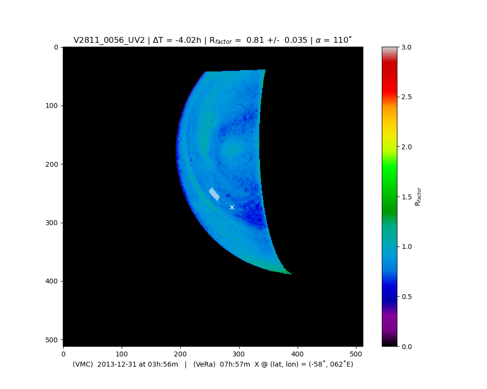
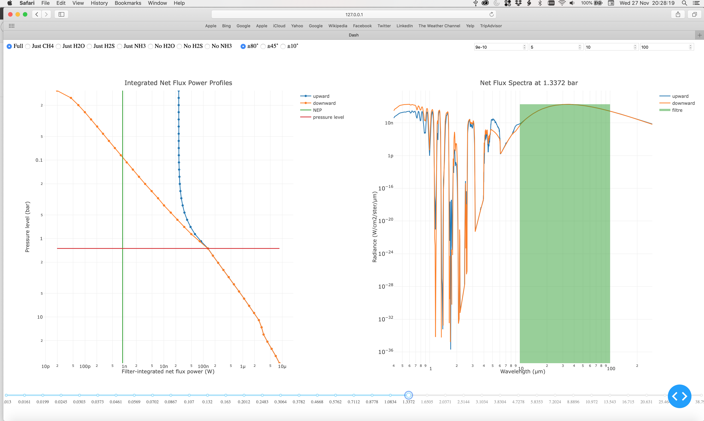
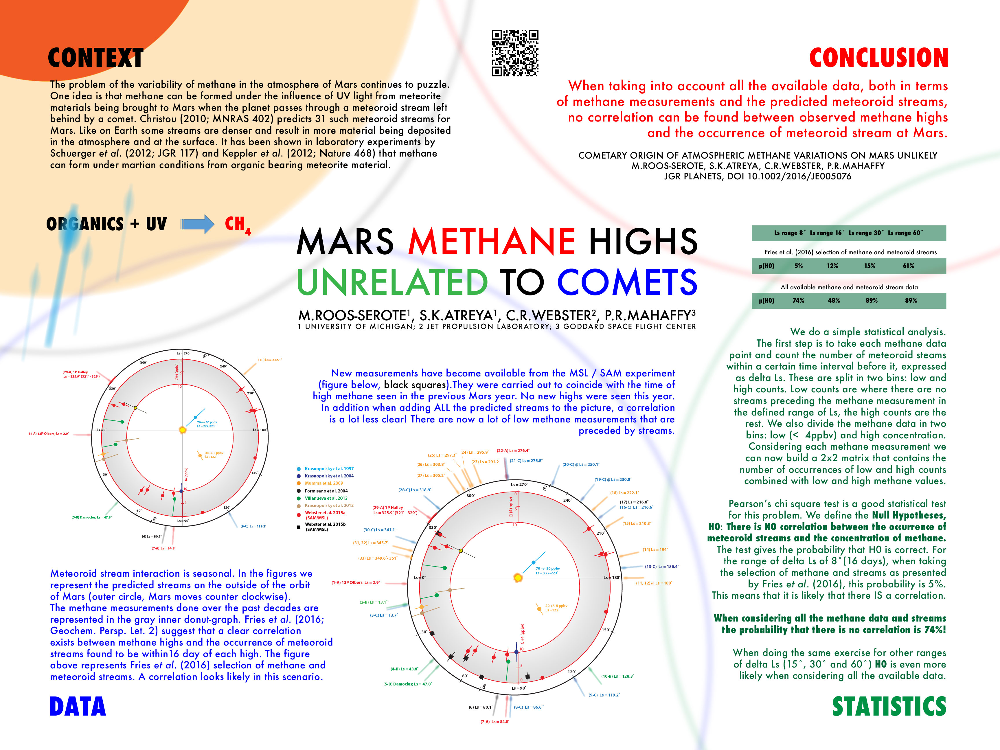

Past short science contracts
============================

Venus Express (Jan. - July 2015 / 2024)
---------------------------------------

| **University of Oxford, UK**
| **Postdoc contract (part-time)**
| **Colin Wilson**
| **Description -** Compare Venus Express VMC UV-images and VeRa radio occultation measurements to study any correlation between UV brightness and the temperature structure recorded simultaneously and at the same location. I initiated this work in 2015. We almost submitted a manuscript for publication in July 2015, but due to several circumstances it got stalled. In early 2024 I decided to completely revamped the entire analysis (in my own time), translating all the scripts I wrote in 2015 from IDL to Python, completely documenting the scrips and the process in an Open Science manner. The entire workflow, including links to all scripts and classes on GitHub, can be found at my `Venus ReadTheDocs pages <https://venusresearchworkbook.readthedocs.io/en/latest/>`_ dedicated to this project.
| **Publication -** :ref:`(2024) Context images for Venus Express radio occultation measurements: A search for a correlation between temperature structure and UV contrasts in the clouds of Venus. <publication36>`

    UV-image taken by the Venus Monitoring Camera (VMC) on 31 December 2013 during ingress. The X marks the spot where the radio occultation was performed at egress and the gray rectangle is the corresponding area at the time of the image.

Netflux Radiometer for ice giants (July - Dec. 2019)
-------------------------------------------------------

| **University of Oxford, UK**
| **Consultancy (invoice)**
| **Patrick Irwin, Simon Calcutt**
| **Description -** Perform a series of mass radiative transfer calculations with `NEMESIS <https://nemesiscode.github.io/>`_ to inform the design of a Net Flux Radiometer instrument to go on a future entry probe to Uranus and/or Neptune. The instrument proposal was led by Shaid Aslam at NASA Goddard Space Flight Center. The result of the calculations was a series 11000+ spectra (0.3 - 300 :math:`{\mu}m`) of the up- and down radiance at different levels in the atmosphere where a probe would be descending, and what a NFR instrument would measure, given certains characteristics of the instrument. To visualise and explore the results I designed a web based Graphical User Interface with `Plotly Dash <http://dash.plotly.com>`_. 
| **Publications -** :ref:`(2020) Advanced Net Flux Radiometer for the Ice Giants <publication33>`, :ref:`(2024) Improved Design of an Advanced Ice Giants Net Flux Radiometer <publication35>`.

    
    Screenshot of the Netflux Radiometer Viewer.

I helped edit these following two animation videos descending through the atmospheres of Uranus and Venus.

.. youtube:: 1MIgMIt_g3A?si=V4f80p-UEfZvctu0 
    
.. youtube:: YkeWhgwp7Xo?si=gtaaZIfhBamjZL-V  

|

Ortho-to-Para ration in water in comet 67P (Nov. 2017 - March 2018)
-------------------------------------------------------------------

| **Observatoire de Paris - PSL, France**
| **Postdoc contract (regular, full time)**
| **Dominique Bockelée-Morvan**
| **Description -** Analysis of Rosetta / VIRTIS-H spectra to improve the determination of the Ortho-to-Para ratio in water vapour observed in the coma of comet 67P/Churyumov-Gerasimenko. Water vapour lines are seen in fluorescence in the coma between 2.5 and 2.9 :math:`{\mu}m`, centered around the :math:`v_{3}` band. The difference of these features between ortho- and para-water is subtle. I worked on extract the best spectra from the available VIRTIS data set to analyse and perform initial fitting of these spectra with synthetic fluorescence spectra. 
| **Publication -** :ref:`(2023) The water Ortho-to-Para ratio in the coma of comet 67P/Churyumov-Gerasimenko. <publication34>`

Methane on Mars and comets (Sep. 2015 - March 2017)
---------------------------------------------------

| **University of Michigan, USA**
| **Postdoc contract (regular, full time)**
| **Sushil Atreya**
| **Description -** I deeply looked into the possibility that methane surges as detected by the Mars Science Laboratory / Sample Analysis at Mars (SAM) instrument could have an origin in meteoritic materials interacting with Mars as it passes through meteor streams on its orbit around the Sun. 
| **Publication -** :ref:`(2016) Cometary origin of atmospheric methane variations on Mars unlikely. <publication32a>`, :ref:`(2017) Reply to comment by Fries on “Cometary origin of atmospheric methane variations on Mars unlikely”. <publication32b>`

Venus Twilight Experiment (Sep. 2015)
-------------------------------------

| **Observatory of the Côte d’Azur, France**
| **Research collaboration contract**
| **Paolo Tanga**
| **Description -** Reducing aureole observations recorded during the transit of Venus in 2012 at different locations around the world. This involved treatment and averaging of hundreds of CCD-images. I used `ImageJ <https://imagej.net/ij/>`_ for the image reduction.
| **Background article -** `(2016) Venus Twilight Experiment. <https://www.europlanet-society.org/venus-twilight-experiment-tanga/>`_
| **Report -** (2015) `pdf of the full report <https://github.com/PleaseStateTheNatureOfYourInquiry/MRSScienceGigs/blob/main/documents/Report_CRT_MaartenRoosSerote_20150720.pdf>`_.
| **Presentation -** `(2016) The thermal field of the terminator mesosphere of Venus using solar transit data. <https://ui.adsabs.harvard.edu/abs/2016DPS....4811509T/abstract>`_

.. youtube:: CbIg6brHYgQ?si=j4gPW0vHxmyuSWw5

|

